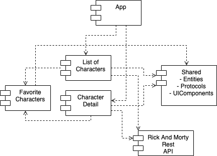
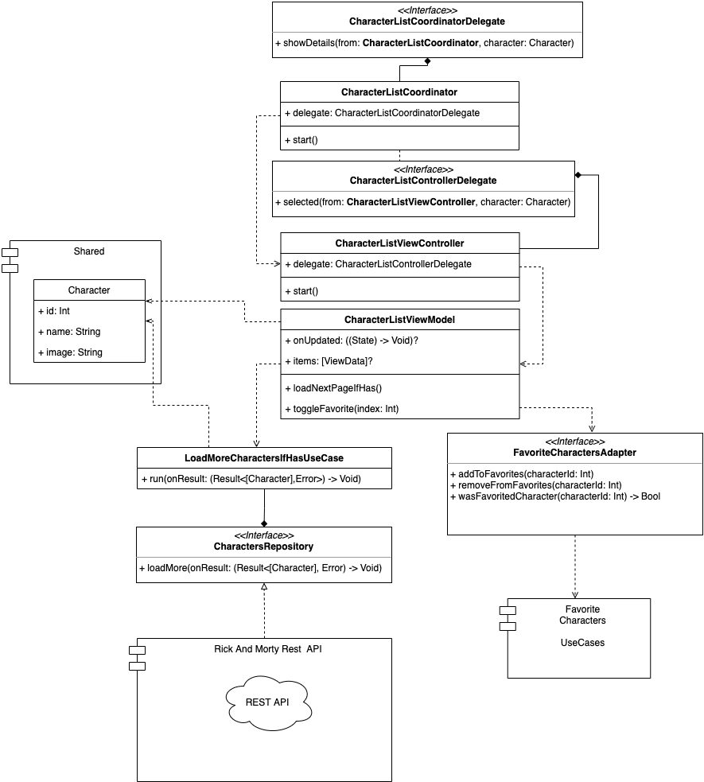
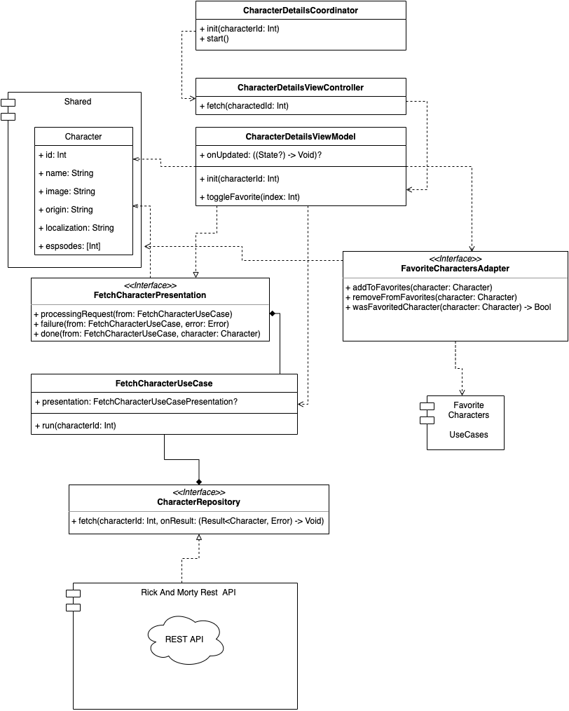
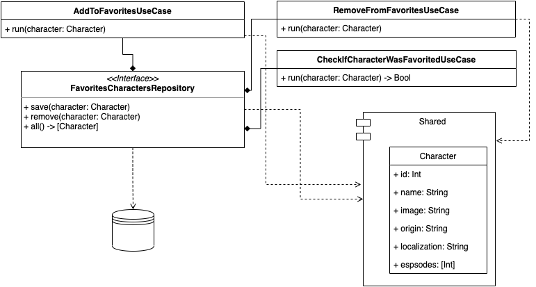

#  Rick and Morty App Example

This project target is make an example with a modular structure using Swift Package Manager as dependency manager

## How to run

Clone this repository and open using XCode 12 or above.

## Running tests

You can use xcode with Application Scheme or each module separately. 
If you prefer you also can run using fastlane using `fastlane test`

## App Scheme

The layer is:

**APP -> Character List, Character Details -> Rick And Morty Rest API, Favorite Characters Feature -> Shared (Entities, UIComponents, Helpers)**

APP can access all layer below but in that case it only access Character List, Character Details. 
All module only can access layers below but never the below layers can know about layers above.

### Workspace Organization

### Character List Scheme (simplified)

### Character Details Scheme (simplified)

### Favorite Characters Feature Scheme

